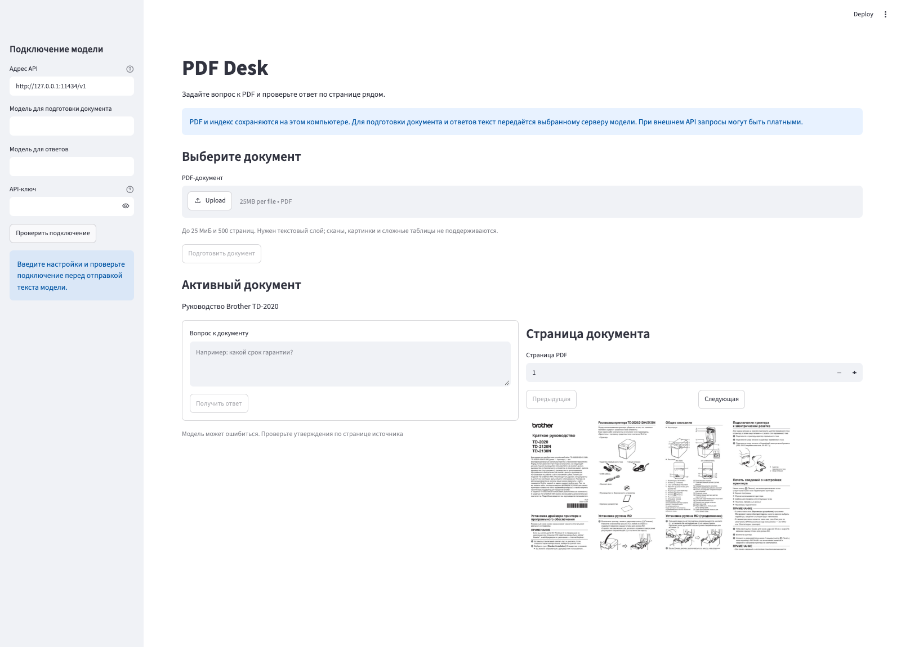

# PDF Desk

[](https://github.com/balyakin/pdf-desk/actions/workflows/tests.yml)
[](requirements.txt)
[](LICENSE)
[](eval/model-check.md)

**Один PDF. Один вопрос. Страница, по которой можно проверить ответ.** PDF Desk открывает документ рядом с ответом модели: прочитали вывод, нажали на источник, сверили его с оригиналом. За подготовку индекса и поиск отвечает [PageIndex](https://github.com/VectifyAI/PageIndex), за показ страницы — [PDFium](https://github.com/pypdfium2-team/pypdfium2).



*На снимке открыто [краткое руководство Brother](https://download.brother.com/welcome/docp000738/td_2020_2120n_2130n_rus_qrg_d02a1c001_01.pdf). Модель не подключена: страницу можно просматривать и без неё.*

## Возможности

- Вопросы на русском языке к PDF с текстовым слоем.
- Ответ с кнопками источников: каждую ссылку можно открыть на физической странице PDF.
- Просмотр изображения страницы и извлечённого текста без повторного обращения к модели.
- Локальное хранение PDF и индекса; ключ API остаётся в текущей сессии приложения.
- Проверка подключения перед отправкой документа: обычный ответ модели и вызов инструмента.

> **Модель ошибается. Иногда — очень убедительно и со ссылкой.** Откройте страницу, прежде чем полагаться на важное утверждение.

## Быстрый старт

Начать можно за несколько команд. Нужны Python **3.11 или новее** и модель с OpenAI-совместимым `POST /chat/completions`; для ответов обязательны `tool_calls`. Берите Python 3.12, если он установлен: именно на нём мы проверили проект локально.

### macOS и Linux

```bash
git clone https://github.com/balyakin/pdf-desk.git
cd pdf-desk
python3.12 -m venv .venv
.venv/bin/python -m pip install -r requirements.txt
.venv/bin/python tests/make_demo_pdf.py
.venv/bin/python -m streamlit run app.py --server.address 127.0.0.1 --server.port 8502
```

Нет команды `python3.12` — подойдёт `python3` версии не ниже 3.11. В Debian и Ubuntu создание окружения иногда требует пакета `python3-venv`.

### Windows PowerShell

```powershell
git clone https://github.com/balyakin/pdf-desk.git
cd pdf-desk
py -3.12 -m venv .venv
.\.venv\Scripts\python.exe -m pip install -r requirements.txt
.\.venv\Scripts\python.exe tests\make_demo_pdf.py
.\.venv\Scripts\python.exe -m streamlit run app.py --server.address 127.0.0.1 --server.port 8502
```

Откройте [http://127.0.0.1:8502](http://127.0.0.1:8502). Терминал оставьте открытым; `Ctrl+C` остановит приложение. Если порт занят, измените число в `--server.port`.

## Подключение модели

Подключение настраивается слева. Четыре поля: адрес API с окончанием `/v1`, две модели и ключ. Если одна модель годится и для подготовки, и для ответов, впишите её имя дважды. Ниже — конфигурация [DeepSeek API](https://api-docs.deepseek.com/guides/tool_calls/), проверенная на коротком PDF:

| Поле | Пример |
|---|---|
| Адрес API | `https://api.deepseek.com/v1` |
| Модель для подготовки документа | `deepseek-flash` |
| Модель для ответов | `deepseek-flash` |
| API-ключ | Ваш ключ DeepSeek; в файлы проекта его записывать не нужно |

Локальная Ollama обычно слушает `http://127.0.0.1:11434/v1`. Ключ для такого адреса можно оставить пустым, но модель всё равно должна уметь вызывать инструменты. Внешнему серверу нужны HTTPS и ключ; названия моделей задаёт сам провайдер. Список `/models` здесь слабая подсказка: поддержку `tool_calls` он не доказывает.

Сначала нажмите **«Проверить подключение»**. Приложение задаст модели подготовки короткий вопрос, затем попросит модель ответов вызвать `ping`. PDF в этих запросах нет. Поменяли адрес, ключ или модель — проверку придётся пройти заново.

**OpenCode Go.** В самом OpenCode подписка работает. Для PDF Desk — пока нет: [правила Go](https://opencode.ai/docs/go/#where-can-i-use-it) ориентированы на coding agents и требуют идентификатор сессии в запросах, а приложение его не отправляет. Попытку подключения и ответ сервера мы сохранили в [отчёте](eval/model-check.md).

## Работа с документом

1. Выберите `data/demo-manual.pdf`, созданный командой быстрого старта, или свой PDF с текстовым слоем.
2. Нажмите **«Подготовить документ»**. Только теперь текст документа будет передан выбранной модели для создания индекса.
3. Задайте вопрос и нажмите **«Получить ответ»**.
4. Откройте кнопку источника под ответом и сравните утверждение с изображением и текстом страницы справа.

Начните с вопроса «Какой срок гарантии?». В демонстрационном PDF ответ — **18 месяцев**, физическая страница 2. Затем спросите цену. Её в документе нет, и хороший ответ должен прямо признать нехватку сведений. Что сказала настоящая модель, записано в [отчёте](eval/model-check.md).

Выдуманную цену или ссылку на чужую страницу зафиксируйте в [бланке пилота](eval/pilot.md). Существующая страница ещё не делает неверное утверждение верным.

## Данные и ограничения

Состояние живёт в `data/` рядом с `app.py`: там PDF, индекс и настройки. В `settings.json` попадут адрес и имена моделей. **Ключ туда не записывается.** Git игнорирует всю папку. Не кладите ключ в `.env` рядом с приложением: PageIndex может загрузить этот файл при запуске. Если выбран внешний API, провайдер получит текст документа и вопросы; такие запросы могут стоить денег, а файлы на вашем диске хранятся без шифрования.

Один пользователь. Один процесс. Один активный документ. PDF может занимать до 25 МиБ и содержать до 500 страниц, но для поиска ему нужен текстовый слой: OCR, чтения текста с картинок, разбора сложных таблиц и сравнения документов здесь нет. Два экземпляра приложения с общей папкой `data/` запускать нельзя.

Загрузили те же байты с прежним адресом и моделью индекса — приложение возьмёт готовый индекс. Смена модели ответов повторной подготовки не требует. А если новый документ подготовить не удалось, прежний останется доступен.

| Ситуация | Действие |
|---|---|
| Сервер отклонил ключ | Проверьте ключ и повторите проверку подключения |
| Проверка `tool_calls` не прошла | Выберите модель с поддержкой вызова инструментов |
| Достигнут лимит запросов | Повторите позже или проверьте тариф провайдера |
| PDF защищён паролем | Сохраните копию без пароля |
| Нет читаемого текста | Используйте PDF с текстовым слоем |
| Операция занята в другой вкладке | Дождитесь её окончания и обновите страницу |

## Проверки

```bash
.venv/bin/python -m pip check
.venv/bin/python -m unittest discover -s tests -v
```

На Windows используйте `.\.venv\Scripts\python.exe` вместо `.venv/bin/python`. После отправки изменений GitHub Actions запустит тесты на Python 3.11 и 3.12. Результат локального запуска, ответы внешней модели и границы этой проверки лежат в [eval/model-check.md](eval/model-check.md).

## Лицензия

[MIT](LICENSE) © 2026 Evgeny Balyakin. PageIndex используется как внешняя зависимость и сохраняет собственную [MIT-лицензию Vectify AI](https://github.com/VectifyAI/PageIndex/blob/main/LICENSE).
